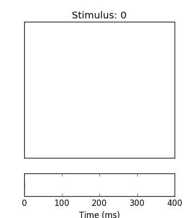
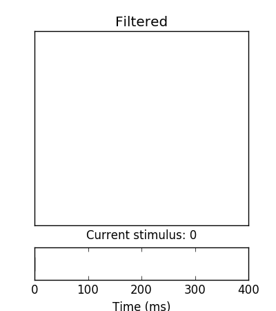
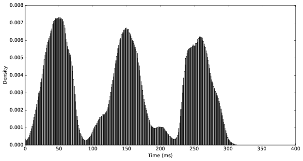
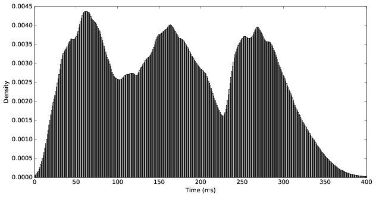
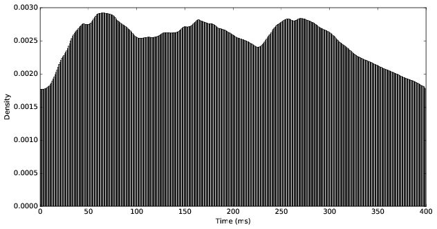

## Event-based image classification with a (stateless) frame-based classifier

Part of the [2016 Telluride Neuromorphic Cognition Engineering Workshop](http://telluride.iniforum.ch/).

### Summary

A [dynamic vision sensor](http://ieeexplore.ieee.org/xpls/abs_all.jsp?arnumber=4444573) (DVS) is a neuromorphic sensor that produces spikes asynchronously as changes in light are detected in a scene. This allows the DVS to run in an event-driven manner at very low power, producing no output if no changes are detected. In order to detect a non-moving stimulus, such as a static image, some motion in the sensor is required, analogous to how our eyes move to detect a scene.

This projects aims to develop a population of *memory* neurons that enable a frame-based classifier implemented on TrueNorth to recognized static images presented to a DVS. This provides a complete neuromorphic solution to image recognition, leveraging current spike-based classification algorithms. Results are obtained using the N-MNIST dataset, described [here](http://www.ncbi.nlm.nih.gov/pmc/articles/PMC4644806/) and available for download [here](http://www.garrickorchard.com/datasets/n-mnist).

### Motivation

The asynchronous nature of the DVS is problematic for many current machine learning algorithms that operate in a stateless frame-based manner in which the entire stimulus is present. For example, k-nearest neighbor (kNN), support vector machine (SVM), and feedforward neural network classifiers operate on a complete stimulus and produce a classification decision or score in a single time step (ignoring the internal computation bounds for classification). Subsequent classifications are independent of each other.

Spike events are continuously produced by the DVS when there is some motion between the DVS and the stimulus. Because of this, only some of the spikes induced by the stimulus will be present within a window of length `T`, assuming `T` is less than the duration of the entire stimulus. As the size of this window approaches 0, the number of stimulus-induced spikes within the window decreases. In practice, `T` may correspond to the clock period of a neuromorphic architecture, such as TrueNorth.

There are a variety of stateless frame-based classifiers that run on TrueNorth, able to make a classification decision in a single time step (1 millisecond at the normal clock rate). This includes a [probabilistic feedforward network](https://papers.nips.cc/paper/5862-backpropagation-for-energy-efficient-neuromorphic-computing) and [convolutional network](https://arxiv.org/pdf/1603.08270.pdf) with trinary weights. The ability to utilize current frame-based classifiers on TrueNorth for images presented to the DVS would provide a complete neuromorphic solution to image classification.

Since it takes time for the stimulus to move and spikes to be generated, some state must be maintained. It would be desirable to be able to separate the stateful properties required to continuously classify a stimulus presented to the DVS from the stateless classifier. Stateless frame-based classifiers are conceptually simple compared to their stateful counterparts (e.g., recurrent networks). This would also allow the individual components to be swapped out based on the task. For example, a stateless classifier trained to recognize digits should be able to be used whether the digits appear very suddenly or slowly. Additionally, a classification decision could be made continuously at every time step despite the raw input being relatively sparse.

### Challenge

Although a frame-based classifier relies on being able to view an entire stimulus, DVS spikes induced by moving stimulus are probably not jointly present at any time. To enable a frame-based classifier, which operates in a single time step, to classify the continuous stream of spikes, some memory of the stimulus must be maintained. There are actually two conflicting requirements for the memory filter: remember and forget. In particular, the memory filter must:

* Integrate spikes from a single stimulus long enough for the stimulus to be recognized. 
* Forget the spikes quick enough to avoid corrupting subsequent stimuli.

This presents a challenge for the memory filter. The two conflicting requirements also create an opportunity to derive the optimal parameters for a memory filter, given the statistics of the stimuli and intervals.

### Solution

A population of leaky integrate and fire (LIF) neurons acts as a short term memory, filtering the spikes from the DVS before passing them to the classifier. The memory neurons remember when a spike occurs by spiking for a short period afterwards. The duration of postsynaptic spiking activity is controlled by a single parameter, `M`. This has the effect of multiplying the spike probability, given the stimulus is present. Specifically, the memory filter transforms the spike probability by

    P(spike | stimulus) -> M * P(spike | stimulus)

where `M` is the memory duration of the filter. This behavior is achieved by setting TrueNorth neuron parameters:

    s = M
    alpha = 1
    gamma = 1

The memory neurons are arranged in a single layer between the DVS and the classifier, with one-to-one synaptic connections between the DVS, memory layer, and the first layer of the classifier.

As an example, consider the spikes induced by a single stimulus:

    

Binned into 1 ms windows, corresponding the clock period of TrueNorth, relatively few spikes are ever jointly observed. After a filter is applied with `M = 10`, the spikes from the stimulus persist long enough for the entire image to be view in a single step:

    

As `M` increases, the spike probability saturates the duration of the stimulus and begins to corrupt the subsequent interval when no stimulus is present (and eventually, when the next stimulus appears.

    

This effect is confirmed by the spike density from time 0, when the stimulus is first presented. Over 1000 samples, the original spike density is given by:

    

After a memory filter with `M = 5` is applied the density is smoothed:

    

A memory filter with `M = 10` produces a greater smoothed density, although still appearing trimodal:

    

At `M = 20`, the spiking probability begins to saturate the duration of the stimulus and overflow into the post-stimulus interval:

    

Since the memory filter has a multiplicative effect on the spike probability, one can hypothesize that optimal performance will occur somewhere around `M = 1 / p`, where `p` is the average neuron spiking probability while the stimulus is present. Assuming the spikes are uniformly distributed from time `0` to `D`, where `D` is the duration of the stimulus, the expected number of spikes is `p * D`. After the filter with `M = 1 / p` is applied, the expected number of spikes increased to `1/p * p * D = D`, i.e., a spike on every time step. Of course, some of these assumptions are violated: stimulus neurons don't all spike with probability `p`, and these are likely not uniformly distributed over time. This can be seen in the spike density plots above, which reflect the way the N-MNIST dataset was collected, namely by three successive saccades.

## Experimental results:

5 core (probabilistic) network trained via Adam (adaptive moment estimation), 100 epochs/1000 samples, implemented on TrueNorth. Weighted max vote is used to make a sample classification decision.

Train 1000 samples for 100 epochs, Adam optimization, 0.5 dropout

Test 1000 samples (~400k frames including 100 ms intervals between stimuli)

Probability frame accuracy:

    Proba train : 0.96
    Proba test  : 0.864
    Spike train : 0.865
    Spike test  : 0.763

Spike frame accuracy:

    Original : 0.405
    Filtered : 0.572

Sample (weighted max vote) accuracy:

    Original : 0.294
    Filtered : 0.754

Example original and filtered output with running frame classification accuracy:

    

### Runtime on TrueNorth:

    1000 samples * ~400 ms per sample = 400 seconds, ~6.6 minutes

## Steps to reproduce

Coming soon...

### Requirements

    tensorflow
    pytruenorth

Run the main script:

    $ python main.py

## Future work

* Grid search on filter parameters, classification accuracy vs p
* Refactor, push to github
* Spike distribution plots (density vs time)
* Rate decay filter
* Receptive field filter, reduce noise and strengthen blobs
* Spike probability after stimulus is removed
* Spike probability before/after filter is applied
* Biological plausibility? Sensor neurons persist after the stimulus changes/moves.
* Differentiate between on/off spikes
* Excitatory/inhibitory receptive neurons
* Smooth the output neurons, class responses
* PCA projection with neurons?
* Inverse network to generate images - stimulate output neurons
* Filter as a preprocessor/feature extractor, multipoint correlations?
* "Responsive filter", e.g., exponential decay. Integrate until the stimulus disappears, then reset abruptly
